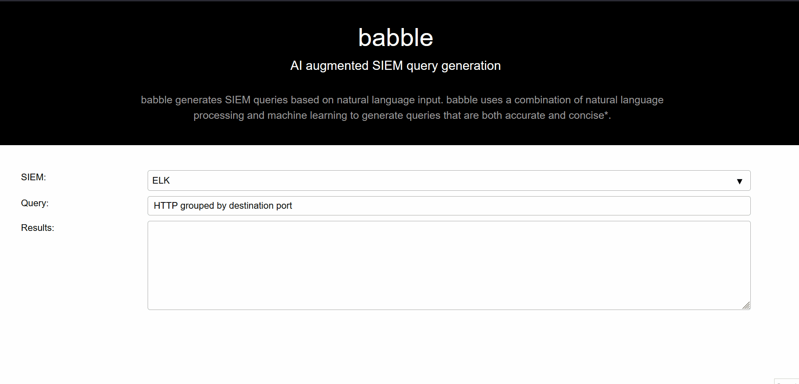

# 🚧 Work In Progress! 🚧


---
## Installation

### Docker

```bash
export SPLUNKBASE_USERNAME=<YOUR USERNAME>
export SPLUNKBASE_PASSWORD=<YOUR PASSWORD>
docker compose up
# Navigate to http://localhost:8000
```


### Python

```bash
python3 -m pip install venv
python3 -m venv venv
source venv/bin/activate
python3 -m pip install --upgrade pip
python3 -m pip install -e .
babble
```


### Parsing PCAP w/ Zeek
```bash
chmod +x tools/bin/zeek.process.sh
./tools/bin/zeek.process.sh
```


---
# DEMO




---
# Notes

## Code Suggestion & Generation

### Suggestion
E.g. searching StackOverflow for answers. see [here](https://github.com/hieunc229/copilot-clone/).


### Generation

---
## Datasets
### PCAP
  - https://github.com/splunk/attack_data
  - https://github.com/splunk/botsv3
  - https://www.malware-traffic-analysis.net/about.html

  - https://wiki.wireshark.org/SampleCaptures
    - `slammer.pcap` -> Slammer worm DCE RPC
    - `dns-remoteshell.pcap` -> Remote shell riding on DNS

  - https://github.com/elcabezzonn/Pcaps
    - `sharp-no-psexec.pcap`
    - `wmi_commands_calc.pcap`
    - `winrm_psremote_05-16.pcap`

  - https://github.com/sbousseaden/PCAP-ATTACK

  - https://www.netresec.com/?page=PcapFiles


### EVTX
  - https://github.com/sbousseaden/EVTX-ATTACK-SAMPLES


### Environments
  - Splunk
    - https://docs.splunk.com/Documentation/StreamApp/8.1.0/DeployStreamApp/UseStreamtoparsePCAPfiles
    - https://gosplunk.com/
    - https://github.com/clong/DetectionLab
    - https://blog.edie.io/2022/01/31/ingesting-pcap-files-with-zeek-and-splunk/


---
## Links
  - https://www.kdnuggets.com/2021/07/github-copilot-open-source-alternatives-code-generation.html
  - https://github.com/samrawal/emacs-secondmate/
  - ELK/KQL
    - https://raw.githubusercontent.com/Security-Onion-Solutions/securityonion/master/salt/soc/files/soc/hunt.queries.json
