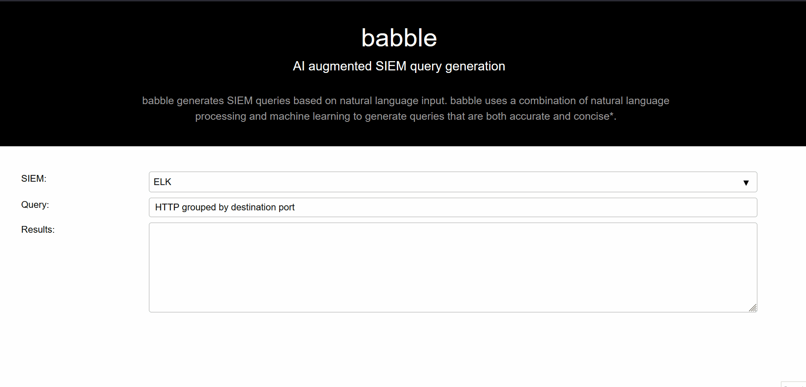
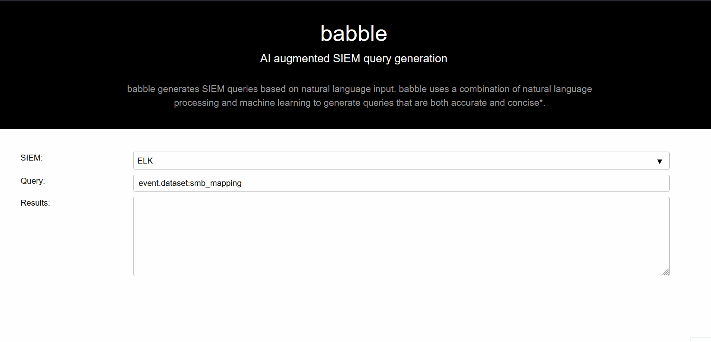

# Work In Progress!





---
## Installation

```
python3 -m pip install venv
python3 -m venv venv
. venv/bin/activate
python3 -m pip install --upgrade pip
python3 -m pip install -e .
```


---
## Testing

```
babble

```
---
# Notes

## Code Suggestion & Generation

### Suggestion
E.g. searching StackOverflow for answers. see [here](https://github.com/hieunc229/copilot-clone/).


### Generation

---
## Datasets
### PCAP
  - https://wiki.wireshark.org/SampleCaptures
  - https://github.com/sbousseaden/PCAP-ATTACK
  - https://github.com/elcabezzonn/Pcaps
  - https://www.netresec.com/?page=PcapFiles

### EVTX
  - https://github.com/sbousseaden/EVTX-ATTACK-SAMPLES


---
## Links
  - https://www.kdnuggets.com/2021/07/github-copilot-open-source-alternatives-code-generation.html
  - https://github.com/samrawal/emacs-secondmate/
  - ELK/KQL
    - https://raw.githubusercontent.com/Security-Onion-Solutions/securityonion/master/salt/soc/files/soc/hunt.queries.json
